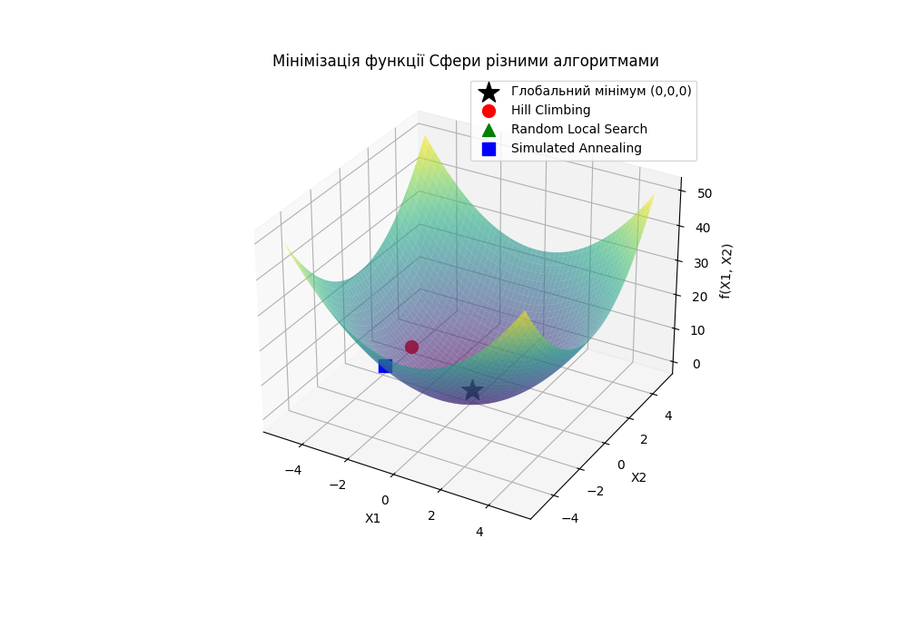

<a id="top"></a>

# goit-algo2-hw-09

## Локальний пошук, евристики та імітація відпалу

Реалізовано програму для мінімізації функції Сфери $f(x) = \sum_{i=1}^{n} x_i^2$, використовуючи три різні підходи до локальної оптимізації:

- Алгоритм «Підйом на гору» (Hill Climbing)
- Випадковий локальний пошук (Random Local Search)
- Імітацію відпалу (Simulated Annealing)

Ця програма реалізує три алгоритми локальної оптимізації для пошуку мінімуму **функції Сфери**: ```Hill Climbing``` (Підйом на гору), Random Local Search (Випадковий локальний пошук) та ```Simulated Annealing``` (Імітація відпалу).

**Реалізація програми для мінімізації функції Сфери**

Функція Сфери є класичним прикладом для тестування алгоритмів оптимізації, оскільки вона має єдиний глобальний мінімум у точці (0,0,...,0) з мінімальним значенням f(x)=0. Це робить її ідеальною для демонстрації, як різні методи пошуку збігаються до оптимального рішення.

📋 Опис програми
Програма складається з наступних компонентів:

- sphere_function(x): Функція, що обчислює значення $f(x) = \sum_{i=1}^{n} x_i^2$.

- **Три алгоритми оптимізації**: Кожен з них шукає оптимальне рішення в заданих межах ```[-5, 5]``` для кожної змінної.

- **Візуалізація**: Використовуючи бібліотеку **matplotlib**, програма створює 3D-графік функції Сфери та позначає на ньому точки, знайдені кожним алгоритмом.

💡 **Очікувані результати**

Після запуску програми ви побачите два типи виведення:

1. **Текстовий вивід у консолі**: Кожен алгоритм виведе знайдене рішення (список координат) та відповідне значення функції.

2. **Графічне вікно**: З'явиться вікно з 3D-графіком, що візуалізує функцію Сфери. На цьому графіку будуть позначені:

- **Глобальний мінімум** (точка ```(0, 0, 0)```) — червоною зіркою.

- **Hill Climbing** — жовтим колом.

- **Random Local Search** — зеленим трикутником.

- **Simulated Annealing** — синім квадратом.



Ця візуалізація допоможе порівняти, наскільки близькими до істинного мінімуму були знайдені рішення.

[Top :arrow_double_up:](#top)

---

>[!tip]
>Створення віртуального оточення:
>```python -m venv venv```
>```venv\Scripts\activate```
>```pip install -r requirements.txt```
>Деактивація віртуального оточення:
>```deactivate```

[Top :arrow_double_up:](#top)